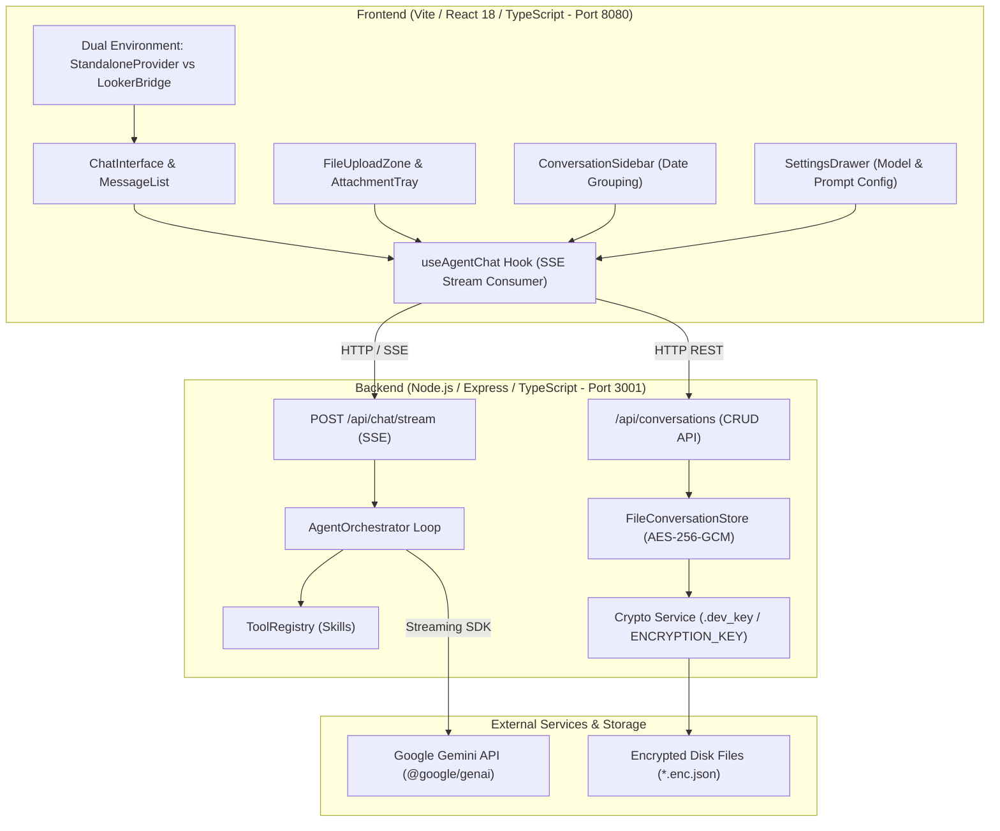

# 🤖 Gemini Chat Agent Starter Kit

> A production-grade, configurable **Gemini Chat Agent Starter Kit** and **Multi-Modal React Chat Interface** powered by Google Gemini models via the official `@google/genai` SDK.
>
> Built as a lightweight, zero-configuration **standalone application** for local development, while strictly adhering to architectural constraints that guarantee **100% compatibility with the Google Looker Extension Framework and embedded dashboards**.

---

## 📑 Table of Contents
1. [What Is This Project?](#what-is-this-project)
2. [Key Capabilities & Features](#key-capabilities--features)
3. [🚀 Custom Agent Developer Guide & Manifest](#-custom-agent-developer-guide--manifest)
4. [System Architecture](#system-architecture)
5. [Architectural Decisions & Rationale](#architectural-decisions--rationale)
6. [Quickstart: Running Locally in 3 Steps](#quickstart-running-locally-in-3-steps)
7. [Commands & Operations Cheatsheet](#commands--operations-cheatsheet)
8. [Testing & Code Quality](#testing--code-quality)
9. [Looker Integration & Extension Guide](#looker-integration--extension-guide)
10. [Troubleshooting & FAQ](#troubleshooting--faq)

---

## What Is This Project?

This application is an AI-powered conversational workspace designed for business intelligence, data inspection, mathematical problem solving, and document analysis. 

Think of it as your personal analytical assistant:
- **Attach Real Files**: You can drag and drop spreadsheets (CSV), raw data (JSON), screenshots or charts (PNG, JPEG, WebP), and documents (TXT, Markdown). The agent reads and inspects them directly.
- **Accurate Math & Analysis**: When asked to compute numbers or profile data, the agent invokes deterministically audited **Skills** (like a built-in calculator and schema profiler) so it never hallucinates mathematical calculations or column statistics.
- **Privacy & Encryption**: All conversation history is automatically encrypted on your computer using bank-grade AES-256-GCM encryption before touching the disk.
- **Zero-Barrier Setup**: You don't even need a Google API key to explore! The application includes an interactive development mode with mock streaming so anyone can clone the repo and immediately test the full UI.

---

## Key Capabilities & Features

### 1. Multi-Modal File Ingestion
- **Images (PNG, JPEG, WebP, GIF)**: Generates instant preview thumbnails and encodes files into Gemini `inlineData` parts. The Gemini model directly interprets diagrams, charts, UI screenshots, or photos.
- **JSON Datasets & CSV Files**: Automatically parsed in-memory. The agent can examine the payload or invoke the `data_inspector` tool to summarize row counts, schema keys, and distribution statistics.
- **Drag-and-Drop Viewport**: Drag files anywhere onto the chat window to queue them in the attachment tray.

### 2. Built-in Agent Skills (Tool Calling)
- **`calculator`**: Deterministically evaluates arithmetic, statistical expressions, and `Math` functions, guaranteeing accurate calculations without LLM math hallucinations.
- **`data_inspector`**: Deeply analyzes JSON/CSV datasets, inferring column data types (`number`, `boolean`, `datetime`, `string`, `object`), null counts, unique frequencies, and numerical ranges (min, max, average).
- **Gemini 3.x Thought Signature Preservation**: Fully complies with Google GenAI's latest function-calling protocol by preserving `thought_signature` parts across multi-turn reasoning loops.
- **Extensible Tool Registry**: Add custom enterprise tools in `server/src/agent/skills/` by implementing the typed `ToolDefinition` interface.

### 3. Encrypted-at-Rest Conversation History
- **AES-256-GCM Authenticated Encryption**: Conversations are encrypted before saving to `server/data/conversations/` with random 96-bit IVs and 128-bit authentication tags to prevent data tampering.
- **Zero-Configuration Key Generation**: Automatically creates a machine-local dev key in `server/data/.dev_key` on first run, or respects `process.env.ENCRYPTION_KEY` in production.
- **Multi-User Isolation**: Data is separated by `userId`. User A cannot view or decrypt conversations belonging to User B.
- **Categorized Drawer**: Past conversations are grouped chronologically (*Today*, *Yesterday*, *Previous 7 Days*, *Older*) with single-click thread loading and deletion confirmation.
- **User Identity Display**: Shows current user credentials and role in the sidebar footer (`Local Developer` in standalone mode, authenticated user in Looker environment).

### 4. Interactive Configuration & Resilient Execution
- **Model Selector & Settings Drawer**: Configure agent display name, welcome tagline, verified Gemini models (`gemini-3.8-flash`, `gemini-3.7-flash`, `gemini-3.1-pro`, `gemini-3.0-pro`, `gemini-2.5-flash`, `gemini-2.0-flash`), and customize system instructions per session.
- **Collapsible Tool Execution Cards**: View real-time status badges (`Running skill: calculator...`), expandable function input arguments, and formatted JSON output responses.
- **Smart Error Recovery & Rollback**: Automatic detection of rate limits (429), high-demand spikes (503 Service Unavailable), and network drops, featuring a `[🔄 Try Again]` button that rolls back the failed agent turn cleanly.

---

## 🚀 Custom Agent Developer Guide & Manifest

This starter kit is specifically engineered to be cloned and transformed into your own custom domain agent (e.g. *Looker Data Advisor*, *Sales Forecasting Assistant*, *Customer Support Copilot*).

All agent persona, configuration, and security settings are version-controlled in the filesystem—not hidden away in opaque browser storage.

### 1. Central Agent Manifest (`agent.config.json`)

The manifest at the project root defines the identity, model, and operational parameters for your agent:

```json
{
  "name": "Looker Data Advisor",
  "tagline": "AI Analytical Assistant for Explores, Visualizations, and KPIs",
  "model": "gemini-3.8-flash",
  "temperature": 0.4,
  "systemPromptFile": "agent.prompt.md",
  "starterPrompts": [
    {
      "title": "Data Profiling",
      "description": "Profile JSON datasets, columns, null rates, and summary statistics.",
      "prompt": "Can you inspect this sample JSON data: [{\"order_id\": 101, \"revenue\": 240.5, \"status\": \"completed\"}, {\"order_id\": 102, \"revenue\": 180.0, \"status\": \"pending\"}]",
      "icon": "data"
    },
    {
      "title": "Skills & Tools",
      "description": "Discover registered skills and functions available to the agent.",
      "prompt": "What skills and tools do you currently have registered?",
      "icon": "skills"
    },
    {
      "title": "Safe Calculations",
      "description": "Execute verified math expressions via the calculator skill.",
      "prompt": "Calculate the compound annual growth rate if initial is 120000 and final is 340000 over 5 years.",
      "icon": "calculator"
    },
    {
      "title": "Looker Integration",
      "description": "Learn how to connect this agent to Looker extensions and iframe URLs.",
      "prompt": "How can I embed this agent interface inside a Looker dashboard or extension?",
      "icon": "looker"
    }
  ],
  "enabledSkills": [
    "calculator",
    "data_inspector"
  ],
  "lockdown": {
    "disableClientOverrides": false,
    "hideSettingsInProduction": true
  }
}
```

#### Manifest Fields:
- **`name`**: The display name of your agent, rendered in browser titles and empty state headers.
- **`tagline`**: Subtitle and description displayed below the agent title on the welcome screen. Use this to summarize the agent's specialization, scope, and capabilities for end users (also configurable live in the dev Settings Drawer).
- **`model`**: Primary Gemini model (e.g. `gemini-3.8-flash`, `gemini-3.7-flash`, `gemini-3.1-pro`).
- **`temperature`**: Sampling temperature sent to the Gemini API (`0.0` for deterministic math/code, up to `1.0` for creative tasks).
- **`systemPromptFile`**: Relative path to the markdown file containing the system instructions.
- **`starterPrompts`**: Configurable starter cards (`title`, `description`, `prompt`, `icon`) displayed on the welcome screen to demonstrate your agent's available tools and skills.
- **`lockdown.disableClientOverrides`**: When `true`, the server strictly ignores any client-side prompt or model tampering.
- **`lockdown.hideSettingsInProduction`**: When `true`, hides the Settings drawer icon in production builds.

---

### 2. System Prompt Engineering in Markdown (`agent.prompt.md`)

Rather than maintaining prompts inside code strings or database rows, author your agent's persona, operating principles, and constraints in standard GitHub-flavored Markdown in `agent.prompt.md`:

```markdown
# Agent Persona & Mission
You are an expert, proactive Looker Data Advisor powered by Google Gemini.
You assist analysts with data interpretation, LookML exploration, and visualization selection.

## Operating Principles & Guidelines
1. **Clarity & Precision**: Always maintain mathematical accuracy and transparency.
2. **Data Inspection**: When the user attaches JSON data, inspect row counts, schema keys, and null rates using the `data_inspector` tool.
3. **Tool Verification**: Use the `calculator` tool whenever precise mathematical operations or statistical rollups are required. Never hallucinate calculated metrics.
```

> [!TIP]
> **Live Hot-Reloading in Development**: While developing locally (`NODE_ENV !== 'production'`), the server automatically detects changes to `agent.prompt.md` and reloads the prompt on the fly. You can tweak your prompt in VS Code and test it on the very next chat message without restarting the server!

---

### 3. Creating Custom Enterprise Skills

To add a new tool or skill to your agent, add a TypeScript file in `server/src/agent/skills/` implementing the typed `ToolDefinition` interface:

```typescript
// server/src/agent/skills/query-runner.ts
import { ToolDefinition } from '../types.js';

interface QueryParams {
  query: string;
  limit?: number;
}

export const queryRunnerTool: ToolDefinition<QueryParams> = {
  name: 'query_runner',
  description: 'Executes a verified SQL or Looker Explore query and returns JSON rows.',
  parameters: {
    type: 'object',
    properties: {
      query: { type: 'string', description: 'SQL or LookML query to run' },
      limit: { type: 'number', description: 'Maximum rows to return (default 50)' },
    },
    required: ['query'],
  },
  execute: async ({ query, limit = 50 }) => {
    // Perform database lookup or Looker API call
    return { status: 'success', rowsRetrieved: 25, sample: [] };
  },
};
```

Register it in `server/src/agent/skills/registry.ts`:

```typescript
import { queryRunnerTool } from './query-runner.js';

export class ToolRegistry {
  constructor() {
    this.register(dataInspectorTool);
    this.register(calculatorTool);
    this.register(queryRunnerTool); // Register your custom skill
  }
}
```

---

### 4. Production Lockdown & Looker Deployment ("The Ship Switch")

When shipping your agent to end-users (e.g. deployed in a corporate portal or embedded inside a Google Looker extension):

1. **Tamper-Proof Execution**: Set `NODE_ENV=production` or configure `"disableClientOverrides": true` in `agent.config.json`. The server enforces your prompt and model on every turn, rejecting any client tampering.
2. **Clean User Interface**: In production, the Settings button is automatically hidden (or placed in read-only mode) so end-users cannot alter system instructions, change models, or bypass domain guardrails.
3. **Automatic Context Ingestion**: When running embedded inside Looker, host environment context (active `dashboardId`, `exploreName`, user credentials) is automatically injected into the turn's system instructions by the orchestrator.

---

## System Architecture



### Monorepo Structure

```
agent-chat-app/
├── agent.config.json                # Central Agent Manifest (name, model, starters, skills, lockdown)
├── agent.prompt.md                  # Authoritative system prompt in Markdown (hot-reloads in dev)
├── server/                          # Backend Agent Service (Node.js / Express / TypeScript)
│   ├── src/
│   │   ├── agent/
│   │   │   ├── agent-config.ts      # Manifest loader, hot-reloader, and lockdown enforcer
│   │   │   ├── gemini-client.ts     # @google/genai SDK client (with dev mock fallback)
│   │   │   ├── orchestrator.ts      # Multi-turn streaming agent loop & multi-modal processor
│   │   │   ├── types.ts             # Typed schemas for messages, parts, attachments & SSE
│   │   │   └── skills/
│   │   │       ├── registry.ts      # Tool registry mapping to Gemini functionDeclarations
│   │   │       ├── calculator.ts    # Built-in tool: safe math evaluation
│   │   │       └── data-inspector.ts# Built-in tool: profiles & inspects JSON/CSV schemas
│   │   ├── routes/
│   │   │   ├── agent-config.ts      # GET /api/agent/config manifest endpoint
│   │   │   ├── chat.ts              # SSE streaming endpoint (POST /api/chat/stream)
│   │   │   └── conversations.ts     # REST endpoints for encrypted history CRUD
│   │   ├── storage/
│   │   │   ├── crypto.ts            # AES-256-GCM authenticated encryption service
│   │   │   └── conversation-store.ts# Encrypted file persistence & user isolation
│   │   ├── utils/
│   │   │   └── logger.ts            # Test-aware application logger (silenced in tests, DEBUG=1 override)
│   │   ├── config.ts                # Environment and default model configurations
│   │   └── index.ts                 # Express server entrypoint
│   ├── test/                        # 13 Node.js native test suites (71 tests)
│   └── package.json
│
├── client/                          # Frontend Application (Vite / React 18 / TypeScript)
│   ├── src/
│   │   ├── components/              # ChatInterface, MessageItem, InputBar, FileUploadZone, etc.
│   │   ├── hooks/
│   │   │   └── useAgentChat.ts      # Custom hook managing SSE stream, retry, and conversation state
│   │   ├── looker/
│   │   │   ├── StandaloneProvider.tsx# Mocks Looker context & local developer identity
│   │   │   ├── LookerBridge.tsx     # Adapter for future Looker Extension SDK integration
│   │   │   └── user-model.ts        # User types and preset development personas
│   │   ├── types/                   # Frontend shared types
│   │   ├── App.tsx                  # Dual-mode environment detector (window.self === window.top)
│   │   └── main.tsx                 # React DOM mount point
│   ├── test/                        # 14 Vitest + Testing Library test suites (88 tests)
│   ├── vite.config.ts               # Vite configuration (port 8080, Looker bundle settings)
│   └── package.json
│
├── package.json                     # Root workspace orchestration
└── README.md                        # Project documentation & reference
```

---

## Architectural Decisions & Rationale

| Decision | What We Chose | Why We Chose It | Alternative Considered & Why Rejected |
| :--- | :--- | :--- | :--- |
| **Streaming Protocol** | **Server-Sent Events (SSE)** | SSE works over standard HTTP/1.1 and HTTP/2, traverses enterprise firewalls effortlessly, supports native browser reconnections, and has zero compatibility issues inside sandboxed iframes. | **WebSockets**: Overkill for unidirectional LLM token streaming; requires dedicated socket servers and is frequently blocked by enterprise proxy gateways and Looker iframe sandboxes. |
| **Encryption at Rest** | **AES-256-GCM** | Authenticated encryption ensures both confidentiality (cipher cannot be read) and integrity (auth tag detects tampering). Machine-local dev key eliminates complex vault setups during onboarding. | **Plain JSON on Disk**: Insecure; leaks user queries, proprietary analytics, and customer data in plain text. |
| **Gemini Integration** | **`@google/genai` (Official SDK)** | The latest official Google GenAI SDK supports Gemini 3.x thought signatures, multi-modal inlineData, and native function calling. | **Legacy `@google/generative-ai`**: Lacks first-class thought signature preservation required for Gemini 3 function calling. |
| **Dual Runtime Mode** | **`window.self === window.top` check** | Automatically detects whether the app is running in a browser tab (Standalone Dev mode) or embedded in an iframe (Looker Extension mode), swapping mock contexts cleanly. | **Hardcoded environment builds**: Requires maintaining separate codebases or separate deployment builds for local vs Looker. |
| **Testing Architecture** | **Native Node Runner (`tsx`) + Vitest** | Tests run 100% offline with zero external network dependencies and complete test isolation. Completes 135 tests in ~2.4s. | **Live Gemini API testing**: Flaky, burns API quota, requires network, and fails in offline CI environments. |

---

## Quickstart: Running Locally in 3 Steps

### Prerequisites
- **Node.js**: `v18.0.0` or higher (tested on Node `20+` and `22+`)
- **npm**: `v9.0.0` or higher
- A browser (Chrome, Edge, Firefox, or Safari)

---

### Step 1: Clone & Install Dependencies
Open your terminal and run:

```bash
git clone <repository-url>
cd agent-proto/agent-chat-app

# Install dependencies for both server and client workspaces
npm install
```

---

### Step 2: Configure Environment *(Optional)*
The server includes a `.env.example` file:

```bash
cd server
cp .env.example .env
```

Open `server/.env` in your text editor:

```env
PORT=3001
GEMINI_API_KEY=your_actual_gemini_api_key_here
GEMINI_MODEL=gemini-3.8-flash
```

> [!TIP]
> **No API Key? No Problem!**
> If you don't have a Gemini API key yet, simply skip adding one. The server will start in **Smart Mock Mode**, providing interactive streaming responses and instructions on how to obtain a free key from [Google AI Studio](https://aistudio.google.com/).

---

### Step 3: Start the Application
From the root directory (`agent-chat-app`), run:

```bash
npm run dev
```

This single command launches both services concurrently:
- 📡 **Backend API Server**: `http://localhost:3001`
- 💻 **Frontend Web App**: `http://localhost:8080`

Open your browser and navigate to:
👉 **[http://localhost:8080](http://localhost:8080)**

---

## Commands & Operations Cheatsheet

All commands should be executed from the `agent-chat-app` root directory:

| Task | Command | Description |
| :--- | :--- | :--- |
| **Start Everything** | `npm run dev` | Runs backend (3001) and frontend (8080) concurrently with hot-reloading. |
| **Start Server Only** | `npm run dev:server` | Starts the Express server using `tsx watch` for auto-restarts on code edits. |
| **Start Client Only** | `npm run dev:client` | Starts Vite dev server with Hot Module Replacement (HMR). |
| **Run All Tests** | `npm test` | Executes all 165 unit tests across backend and frontend with zero noise. |
| **Run Tests with Debug Logs** | `npm run test:debug` | Runs tests with full application debug logging visible in the console. |
| **Generate Coverage Report** | `npm run test:coverage` | Prints detailed line/branch/func coverage tables for both workspaces. |
| **View Visual Coverage** | `open client/coverage/index.html` | Opens the interactive line-by-line HTML coverage report in your browser. |
| **Run Specific Backend Test** | `DEBUG=1 npx tsx --test server/test/orchestrator.test.ts` | Runs an individual backend test file with verbose application logs. |
| **Run Specific Frontend Test** | `npx vitest run client/test/ChatInterface.test.tsx` | Runs an individual client test file via Vitest. |

---

## Testing & Code Quality

The project maintains **~98.5% test coverage** with 165 unit tests across 27 suites that execute in **~2.5 seconds**:

```text
Test Summary:
✔ Backend (server):  73 / 73 passed (100% on core services) ~0.5s
✔ Frontend (client): 92 / 92 passed (100% on all components) ~2.0s
Total: 165 passed, 0 failed, 0 warnings
```

### Coverage by Component & Module

| Area | Module / Component | Line Coverage | Status |
| :--- | :--- | :---: | :---: |
| **Frontend** | `App.tsx` | **100%** | ✅ Full |
| **Frontend** | `AttachmentChip.tsx` | **100%** | ✅ Full |
| **Frontend** | `ChatInterface.tsx` | **100%** | ✅ Full |
| **Frontend** | `ConversationSidebar.tsx` | **100%** | ✅ Full (100% all) |
| **Frontend** | `FileUploadZone.tsx` | **100%** | ✅ Full |
| **Frontend** | `InputBar.tsx` | **100%** | ✅ Full |
| **Frontend** | `MessageItem.tsx` | **100%** | ✅ Full (100% all) |
| **Frontend** | `MessageList.tsx` | **100%** | ✅ Full |
| **Frontend** | `SettingsDrawer.tsx` | **100%** | ✅ Full |
| **Frontend** | `ToolExecutionCard.tsx` | **100%** | ✅ Full |
| **Frontend** | `LookerBridge.tsx` & `StandaloneProvider.tsx` | **100%** | ✅ Full |
| **Frontend** | `useAgentChat.ts` | **97.22%** | ✅ Near-Full |
| **Backend** | `gemini-client.ts` | **100%** | ✅ Full (100% all) |
| **Backend** | `orchestrator.ts` | **100%** | ✅ Full |
| **Backend** | `registry.ts` | **100%** | ✅ Full (100% all) |
| **Backend** | `conversations.ts` (routes) | **100%** | ✅ Full |
| **Backend** | `conversation-store.ts` (storage) | **100%** | ✅ Full |
| **Backend** | `crypto.ts` | **98.00%** | ✅ Near-Full |
| **Backend** | `chat.ts` (routes) | **96.83%** | ✅ Near-Full |
| **Backend** | `calculator.ts` & `data-inspector.ts` | **100% Logic** | ✅ Full (Types stripped) |

### Debugging While Developing Tests
When writing or troubleshooting tests, you can inspect the application's internal logs by passing the `DEBUG=1` environment variable:

```bash
# Debug a specific backend test
DEBUG=1 npx tsx --test server/test/orchestrator.test.ts

# Debug all tests
DEBUG=1 npm test
```

---

## Looker Integration & Extension Guide

This application was engineered to serve as a standalone application today while guaranteeing **100% architectural compatibility with Looker** when deployed as a Looker Extension or inside an embedded dashboard.

### The 6 Golden Rules of Looker Extensions

1. **Client-Side SPA Only (No SSR)**: Looker loads a single JavaScript bundle into a sandboxed iframe. This application compiles cleanly into static JS/CSS via Vite.
2. **Container-Relative Sizing (No `100vh`)**: The chat UI uses flexbox and `h-full` / `w-full` rather than viewport units, seamlessly adapting to whatever tile or drawer size Looker allocates.
3. **In-Memory File Processing**: File uploads use the standard browser `FileReader` API and base64 strings—no server filesystem dependencies.
4. **Partitioned Storage Safety**: `StandaloneProvider` safely handles Chrome's third-party partitioned cookie/storage restrictions with in-memory fallbacks.
5. **No Window Redirects**: State is contained within the application without modifying `window.top.location`.
6. **Whitelisted API Routing**: All backend requests flow through the configured API origin, ready for Looker's `manifest.lkml` `external_api_urls` declarations.

### Upgrading to Looker Extension in Production

When you are ready to embed the chat assistant directly inside Looker:

1. Install Looker's extension SDK in `client/`:
   ```bash
   cd client
   npm install @looker/extension-sdk @looker/extension-sdk-react
   ```
2. Build the production single bundle:
   ```bash
   npm run build:client
   ```
3. Configure your LookML `manifest.lkml`:
   ```lookml
   project_name: "gemini-agent-extension"

   application: gemini-chat-agent {
     label: "Gemini AI Analyst"
     url: "http://localhost:8080/bundle.js" # Or "file: dist/bundle.js" for production
     entitlements: {
       external_api_urls: [
         "http://localhost:3001",
         "https://api.your-agent-backend.com"
       ]
       core_api_methods: ["me", "run_inline_query"]
     }
   }
   ```

---

## Troubleshooting & FAQ

### 1. "Port 8080 or 3001 is already in use"
Another process is using the port. You can terminate the conflicting process or change the port:
```bash
# Find and kill process on port 8080 (Mac/Linux)
lsof -i :8080 | awk 'NR>1 {print $2}' | xargs kill -9

# Find and kill process on port 3001 (Mac/Linux)
lsof -i :3001 | awk 'NR>1 {print $2}' | xargs kill -9
```

### 2. "Gemini API rate limit exceeded (429)" or "503 Service Unavailable"
Spikes in Gemini demand or free-tier quotas can occasionally return 429 or 503 errors. 
- The UI will present an error card with a **`[🔄 Try Again]`** button.
- Clicking **Try Again** automatically rolls back the failed turn and retries the prompt.
- Alternatively, open the **Settings Drawer** (top right gear icon) and switch to another model like `gemini-2.5-flash`.

### 3. "How do I reset my encryption key or wipe stored chats?"
Conversations are stored in `server/data/conversations/`. To reset everything to a clean slate:
```bash
rm -rf server/data/conversations/*
rm -f server/data/.dev_key
```
A fresh key will be generated automatically on the next server request.

---

## License

This project is licensed under the MIT License. Contributions and extensions are welcome!
